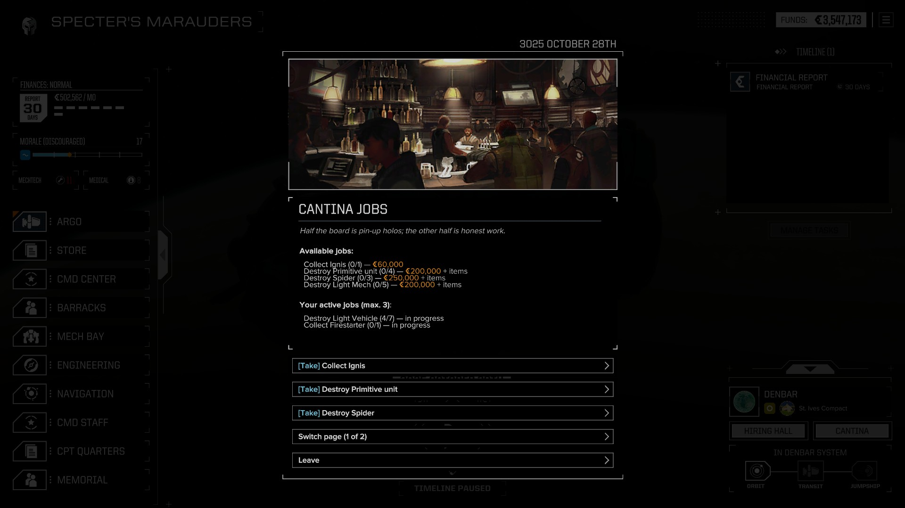
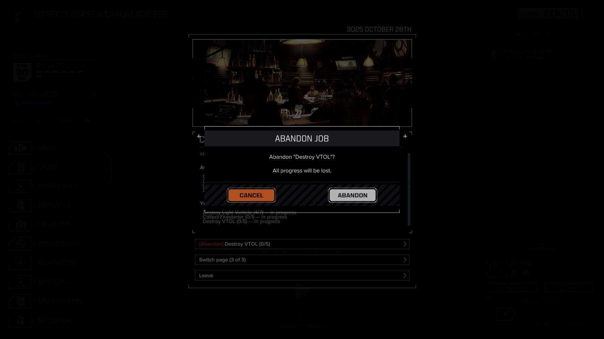

# BTCantinaMissions

A job board in the local cantina for HBS BattleTech (Unity + HarmonyX, ModTek).

<p align="center">
  <br>
  <em>The job board on a cantina world — offers with payouts, page switcher, active jobs.</em>
</p>

<p align="center">
  <br>
  <em>Abandoning a job asks for confirmation — all progress is lost. Delivering a consuming job gets one too, spelling out exactly what leaves your inventory.</em>
</p>

The DLL is modpack-agnostic; job/reward definitions live in per-modpack packs
(`packs/<Name>/` in the repo). Releases are **self-contained drop-in zips per
supported modpack** (`BTCantinaMissions-<Pack>-v<version>.zip`); the RT pack
(the maintained one) ships with the release. Requirements below describe the RT
pack configuration. To support another modpack, copy `packs/RT` as a starting
point and retarget the pools — see `packs/RT/BALANCE.md` for the balancing
methodology.

Planets carrying the tag configured in `PlanetTag` (default: `planet_other_cantina`)
get a cantina. The store button in the location bar (the one next to Hiring hall) is
**replaced** by a **Cantina** button. It is enabled everywhere: on cantina planets it
opens the full job board; anywhere else it opens your **contract ledger** — active
jobs with live progress, deliverable and abandonable from any world, but no new
offers (those are only posted on cantina worlds). The store itself stays reachable
through the left navigation menu (provided by IRTweaks).
Inside the board: small jobs — destroy specific units, collect items, acquire
mechs or salvage parts. Take a job, do the work out in the field, come back and
deliver it for C-Bills (and bonus items). The board refreshes monthly.

## Requirements

| Mod | Status |
|---|---|
| [ModTek](https://github.com/BattletechModders/ModTek) | required |
| [JwTweaks](https://github.com/wmtorode/JwTweaks) (CustomSaveBlocks enabled) | **hard dependency** — mod state persists through its custom save blocks |
| [IRTweaks](https://github.com/BattletechModders/IRTweaks) (StreamlinedMainMenu enabled) | **hard dependency** — provides the left navigation menu, the only remaining way into the store once the vanilla store button is repurposed |
| [CustomSalvage](https://github.com/BattletechModders/CustomSalvage) | optional — improves chassis-family resolution for mech/part jobs |
| [LewdableTanks](https://github.com/BattletechModders/LewdableTanks) | optional — vehicles enter the hooks as fake mechs; enables chassis-family resolution for them (`VAssemblyVariant`) |
| [BTSimpleMechAssembly](https://github.com/mcb5637/BTSimpleMechAssembly) | optional — alternative chassis-family source for mech/part jobs |

Chassis-family resolution is a cascade: the `unit_chassis_*` unit tag first,
then CustomSalvage's AssemblyVariant, then (for LewdableTanks fake-vehicles)
`VAssemblyVariant` on the real vehicle chassis, then BTSimpleMechAssembly's
variant lookup, finally the chassis display name. A missing mod simply skips
its step; version drift in modpacks degrades gracefully with a log warning
instead of crashing.

## Gameplay

- The board is **global** (one per campaign), regenerated when you visit any cantina
  planet or at the start of each month. Taken jobs are never wiped by the refresh.
- Up to `MaxActiveJobs` jobs at once; duplicates of the same job/target are blocked at take time.
- Take / Deliver / Abandon straight from the board popup — it updates in place.
  Delivering a consuming job and abandoning ask for confirmation: a dialog over
  the board lists exactly what will be removed (and the payment) — **Enter**
  confirms, **Esc** cancels.
- **Esc** closes the board and reward popups.
- Job types:
  - **DestroyUnits** — kill N units matching a tag set (`unit_vtol`, `unit_mech&unit_light`,
    `unit_light&unit_turret`...) — mechs, vehicles and turrets alike.
  - **DestroyChassis** — kill N units of a specific chassis family ("Destroy 3 Locust",
    "Destroy 2 Scimitar") — mechs and vehicles (LewdableTanks); forcing the pilot to
    eject counts. Only units
    **destroyed by your own lance** count: allied and employer forces (MissionControl
    allies, base turrets) finishing your targets do not advance the job. Forcing a
    pilot to eject (including PanicSystem panic ejections) counts as a kill. Works in
    any **campaign** contract, regardless of mission outcome; skirmish never counts.
  - **CollectItems** — obtain N of a specific component.
    `Acquire` mode: keep them, the reward pays for reaching the goal.
    `Deliver` mode: the items are removed from your inventory on delivery.
    Deliver progress **mirrors the live inventory**: it starts from what you
    already have in stock when you take the job (shown right on the board),
    follows every purchase, sale and installation, and is re-synced on every
    save load. Stock above the target shows as "· N in stock" — selling from a
    surplus keeps the job ready; dropping below the target sets it back with a
    red toast.
  - **CollectMech** — bring in a unit of the given chassis family (e.g. any Locust;
    with LewdableTanks this includes vehicles — any Scimitar, Saracen, VTOL...).
  - **CollectMechParts** — collect N salvage parts of the family (mech or vehicle).
- Rewards: a base C-Bill amount (from the job def) plus an optional item
  collection roll, shown in a reward popup with a full breakdown. At payout
  time the C-Bill base is multiplied by the career's **Contract Payment**
  economy slider — the same `Finances.ContractPricePerDifficulty` coefficient
  the game uses for contract payouts (e.g. Cheapskate 50% pays half, Generous
  150% pays one and a half times; the base numbers are balanced against the
  Normal 100% baseline). Target counts and item rolls are **not** scaled —
  only C-Bills. Delivering items you no longer have is blocked.
- **Location-specific jobs**: some jobs only appear on cantinas located on planets
  with a certain tag — exotic hardware on `planet_other_blackmarket` worlds,
  electronics contracts on `planet_other_comstar` worlds.
- Toast notifications for progress, READY state and rewards (toggle in settings).

## Settings (`settings.json`)

A template with the pack's defaults ships inside each pack zip (repo:
`packs/<Pack>/settings.json`); it is only seeded on install and never
overwritten afterwards — local tweaks survive updates.

```jsonc
{
  "PlanetTag": "planet_other_cantina", // which planets have a cantina
  "JobsPerBoard": 4,                  // jobs offered per board
  "MaxActiveJobs": 3,                 // concurrent active jobs
  "NotifyOnProgress": true,            // toasts on progress ticks
  "NotifyOnReady": true,               // green READY toast / red NOT READY toast
  "DebugLogging": false,               // verbose log to .modtek/battletech.log
  "DumpStateOnSave": false,            // debug: state_dump.json next to the mod
  "DisplayNameTagOverrides": {         // display names for DestroyUnits tag targets;
    "unit_vtol": "VTOL",               // replaces the whole dictionary when present —
    "unit_legendary": "Legendary unit",  // include the defaults you want to keep;
    "unit_primitive": "Primitive unit"  // unlisted tags fall back to humanization
  }
}
```

## For modders: adding jobs

Jobs are `CantinaJobDef` JSON files (in the repo: `packs/<Pack>/jobs/`; in the
installed mod: `jobs/` at the mod root — the packaging step flattens the pack).
They are registered as a ModTek `CustomResourceTypes` entry in the pack's
`mod.json`:

```jsonc
{
  "Description": {
    "Id": "cantinaJob_collectItems",
    "Name": "Collect {target}",     // {target} is substituted from the pool
    "Icon": ""
  },
  "ObjectiveType": "CollectItems",  // DestroyUnits | DestroyChassis | CollectItems | CollectMech | CollectMechParts

  // Target pool — the generator picks one random entry per board slot.
  // Use the pool matching the objective type; single-entry pool = fixed target.
  "UnitTagPool": ["unit_vtol", "unit_light&unit_mech"],        // DestroyUnits, & = all tags
  "ChassisPool": ["locust", "stinger", "Scimitar"],            // DestroyChassis / CollectMech / CollectMechParts
  "ItemPool": [                                                // CollectItems — explicit catalog:
    { "Id": "Weapon_Laser_Medium", "ItemType": "Weapon" },     //   the ID prefix alone is not
    { "Id": "Gear_Engine_XL", "ItemType": "HeatSink" }         //   reliable for modded items
  ],

  "MinTargetCount": 5,              // random count range per instance
  "MaxTargetCount": 10,
  "ItemMode": "Acquire",            // Acquire | Deliver (CollectItems only)

  "Reward": {
    "CBills": 150000,                        // fixed payout
    "ItemCollection": "CantinaReward_Tier1", // optional itemCollection CSV id
    "ItemCount": 1                           // weighted-random rolls from it (default 1)
  },

  "MinSystemDifficulty": 1,         // board eligibility per system
  "MaxSystemDifficulty": 20,
  "RequiredSystemTags": [],         // planet gate: the job only appears on cantinas
                                    // of systems carrying ALL of these tags
  "Weight": 8                       // weighted pick among eligible defs
}
```

`ItemType` is the vanilla `ComponentType` enum: `Weapon | AmmunitionBox | HeatSink |
JumpJet | Upgrade`.

`RequiredSystemTags` gates a job to specific worlds — all listed tags must be on
the star system for the job to enter its cantina board. Tags live in the star
system definitions (e.g. the InnerSphereMap data): examples from the shipped jobs
are `planet_other_blackmarket` (exotic hardware) and `planet_other_comstar`
(electronics contracts). Use it for regional/location flavor.

Destroy-units targets should be things the player can identify in combat by sight
(unit type, weight class, recognizable archetype like carriers). A tag's display
name is controllable: add a `DisplayNameTagOverrides` entry in `settings.json`
to map any specific tag to a proper human-readable name (unlisted tags fall back
to automatic humanization of the tag id). That fixes what the **board** says — but
the player still has to recognize the target on the field, so purely internal
spawn markers such as `unit_indirectFire` remain frustrating targets even with a
pretty name.

Reward collections are vanilla `ItemCollectionDef` CSVs (`packs/<Pack>/rewards/`;
`rewards/` in the installed mod) — `id, type, count, weight`. A roll grants one weighted-random entry per
`ItemCount`; missing or empty collections are not an error — the C-Bills still
pay out.

To give a planet a cantina, add the tag from `PlanetTag` (default `planet_other_cantina`) to its definition.

## Building from source

- .NET SDK, `dotnet build` (net472; targeting packs come from
  `Microsoft.NETFramework.ReferenceAssemblies`, so Visual Studio is not required).
  Use `-c Release` for shipping binaries; `-p:DeployDir=...` copies the DLL into
  the mod folder automatically after the build.
- Copy `CHANGEME.Directory.Build.Props` to `Directory.Build.Props` and point it at
  your game/mod folders (the build then deploys the DLL **plus the dev pack**
  — `packs/RT` by default, override with `-p:Pack=<Name>` — into the game mod
  folder, cleaning stale pack files first).
- Release artifacts: `python package.py [Pack ...]` builds the DLL and zips
  every pack (or the listed ones) into `dist/`. Packs are versioned in lockstep
  with the DLL — a `mod.json` version mismatch against `AssemblyVersion` fails
  the packaging.
- HarmonyX is referenced from `ModTek/lib`; private fields are accessed via
  [Krafs.Publicizer](https://github.com/pardeike/Publicizer) — `Assembly-CSharp`
  and `BTSimpleMechAssembly` are publicized (compile-time copies only; at runtime
  the original assemblies are used as-is). `InControl.dll` is a build-time-only
  reference (the `PlayerAction` type appears in `GenericPopupBuilder` signatures).

## Known limitations

- **Deliver mode** is only supported for `CollectItems`. `CollectMech` /
  `CollectMechParts` always behave as `Acquire` (nothing is removed): picking the
  exact mech out of a family, or splitting parts across variants, needs a
  selection UI that does not exist yet.
- **Destroy targets** are limited to traits the player can identify in combat
  (unit type, weight class, recognizable archetypes such as carriers) — by
  design; see the note for modders above.
- **JwTweaks** is a hard dependency for persistence: mod state survives
  saves/loads exclusively through its custom save blocks. The `CustomSaveBlocks`
  feature must be enabled — with it off, the board regenerates on every load
  and all job progress is lost. Startup checks the toggle in JwTweaks' mod.json
  and logs a loud warning when it is off (there is no in-game notice).
- **IRTweaks** is a hard dependency because the cantina button replaces the
  vanilla store button — its `StreamlinedMainMenu` feature must stay enabled,
  otherwise the store becomes unreachable. Startup checks this toggle too and
  warns in the log.
- The monthly board refresh is anchored to the financial report and is skipped
  while in transit (the board regenerates on the next cantina arrival).
- English only, no localization.

## License

MIT — see [LICENSE](LICENSE).

## Status

v0.4 — on top of the v0.3 functional core (board generation, all four job
types, persistence, rewards, notifications, paginated UI): inventory-tracking
hardening (all `AddItemStat`/`RemoveItemStat` overloads, stat-key id
normalization), Deliver progress mirrors the live inventory with an on-board
stock display, turret destroy targets, MRM/LBX ammo in reward rolls, confirm
dialogs for Deliver/Abandon (Enter confirms, Esc cancels), Esc closes the
board and reward popups.

Planned for v0.5: LewdableTanks integration (vehicle collect jobs,
chassis-specific destroy jobs).
